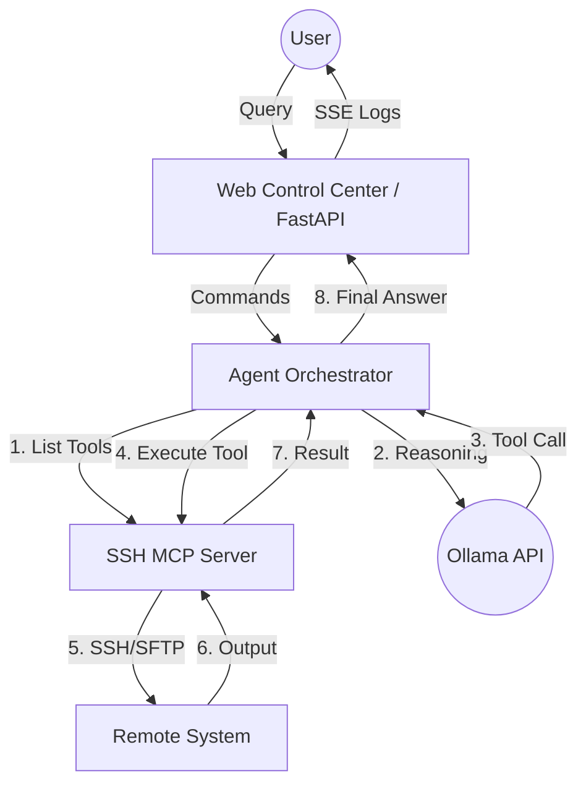

# SSH MCP Agent with Ollama Control Center

An extensible Model Context Protocol (MCP) Agent that can SSH into systems, execute commands, and transfer files. Powered by Ollama with dynamic tool-calling compatibility for a wide range of LLMs.

## 🚀 Overview

This project implements a complete Agentic AI system consisting of:
1.  **MCP SSH Server**: Exposes SSH capabilities (exec, upload, download) via the Model Context Protocol.
2.  **Extensible LLM Client**: A dynamic client for Ollama that auto-detects and supports multiple tool-calling formats (Native, JSON, XML).
3.  **Agent Orchestrator**: The "brain" that connects the LLM to the MCP tools.
4.  **Web Control Center**: A modern, split-pane Web UI to interact with the agent and monitor tool execution in real-time.

---

## 🛠 Design Choices & Implementation Details

### 1. Extensible MCP Architecture
We use the official `mcp` Python SDK. The server (`src/ssh_mcp_agent/server.py`) is decoupled from the agent. It uses `paramiko` for robust SSH/SFTP operations.
*   **Why?** By using MCP, this server can be used by *any* MCP-compliant client (like Claude Desktop or other agents), not just our own.

### 2. Dynamic LLM Client (Ollama)
Different models have different strengths in tool calling. Our `OllamaClient` (`src/ssh_mcp_agent/llm/client.py`) supports:
*   **Native**: Uses Ollama's built-in `/chat` tools support (best for Llama 3.1/3.2, Qwen 2.5).
*   **JSON**: Injects tool definitions into the system prompt and forces JSON output (best for smaller models).
*   **XML**: Uses `<tool_call>` tags, which are often more reliable for models like Mistral.
*   **Auto-detection**: Automatically inspects the model's template to choose the best format.

### 3. Real-time Web UI
Built with **FastAPI** and **Tailwind CSS**. It uses **Server-Sent Events (SSE)** to stream tool execution logs from the background agent to the browser.
*   **Split Layout**: Chat on the left, "Raw" execution logs on the right. This is designed for learning, allowing you to see exactly how the LLM decides to call tools and the raw output it receives.

---

## 🏗️ Architecture & Data Flow

Understanding how the different components interact is key to extending the system.



1.  **User Interaction**: The user enters a request (e.g., "Check the disk space").
2.  **Tool Discovery**: The Agent connects to the SSH MCP Server and discovers available capabilities (`ssh_exec`, `ssh_upload`, etc.).
3.  **Context Assembly**: The Agent sends the user query and the tool schemas to Ollama.
4.  **LLM Decision**: Ollama analyzes the request and determines which tool(s) to call and with what arguments.
*   **Secure Execution**: The Agent routes the tool call to the MCP Server, which performs the actual SSH operation using the credentials looked up from the Host Manager. The LLM only sees host identifiers, never sensitive credentials.
6.  **Streaming Feedback**: Every step of the process is streamed back to the Web UI via SSE, allowing the user to see the internal "thought process" of the AI.

---

## 📜 The Model Context Protocol (MCP) Standard

The Model Context Protocol (MCP) is an open, JSON-RPC 2.0 based communication protocol developed by Anthropic. It provides a standardized interface for LLM applications (Hosts) to discover and interact with external data and tools (Servers).

### 1. Key Principles
*   **User Consent and Control**: The user must explicitly authorize and understand all data access and operations.
*   **Security and Trust**: Implementations must prioritize security, as MCP provides powerful capabilities for arbitrary data access and code execution.
*   **Composability**: MCP servers can be combined into complex workflows across different AI systems.

### 2. Protocol Architecture

#### A. Participants
*   **Hosts**: LLM-powered applications (e.g., Claude Desktop, IDEs, or this Agent Orchestrator) that initiate the communication and coordinate context.
*   **Clients**: The protocol-aware component within the Host that manages a single connection to a Server.
*   **Servers**: Specialized services that expose capabilities (Tools, Resources, Prompts) via the protocol.

#### B. Transport Layer
MCP is transport-agnostic but primarily uses:
*   **stdio**: Local communication using standard input/output (ideal for local tools).
*   **HTTP with SSE**: Remote communication using Server-Sent Events (ideal for cloud services).

### 3. Core Primitives

| Primitive | Description | Core Methods |
| :--- | :--- | :--- |
| **Resources** | URI-addressed read-only data (e.g., files, database logs). | `resources/list`, `resources/read` |
| **Tools** | Executable functions the LLM can call (e.g., `ssh_exec`). | `tools/list`, `tools/call` |
| **Prompts** | Reusable templates with parameters (e.g., "Analyze this code"). | `prompts/list`, `prompts/get` |

### 4. Communication Lifecycle

#### Handshake & Initialization
The connection starts with an exchange of capabilities:
1.  **Client `initialize` request**: Sends client info and supported capabilities.
2.  **Server `initialize` response**: Sends server info and capabilities.
3.  **Client `initialized` notification**: Completes the handshake.

**Example Handshake (Client to Server):**
```json
{
  "method": "initialize",
  "params": {
    "protocolVersion": "2024-11-05",
    "capabilities": { "roots": { "listChanged": true } },
    "clientInfo": { "name": "SSHMCPAgent", "version": "1.0.0" }
  },
  "jsonrpc": "2.0",
  "id": 1
}
```

#### Operational Phase
Once initialized, the Host can interact with the server's primitives:

**1. Tool Call (Client to Server):**
```json
{
  "method": "tools/call",
  "params": {
    "name": "ssh_exec",
    "arguments": { "command": "ls -la" }
  },
  "jsonrpc": "2.0",
  "id": 2
}
```

**2. Resource Read (Client to Server):**
```json
{
  "method": "resources/read",
  "params": { "uri": "file:///project/README.md" },
  "jsonrpc": "2.0",
  "id": 3
}
```

**3. Prompt Get (Client to Server):**
```json
{
  "method": "prompts/get",
  "params": {
    "name": "explain_code",
    "arguments": { "code": "print('hello')" }
  },
  "jsonrpc": "2.0",
  "id": 4
}
```

**4. List Notifications (Server to Client):**
If the server's tools change, it sends a notification:
```json
{
  "method": "notifications/tools/list_changed",
  "jsonrpc": "2.0"
}
```

### 5. Advanced Capabilities

*   **Sampling**: Allows the Server to request an LLM completion from the Host (e.g., to ask for a summary of data).
*   **Roots**: Allows the Host to provide a list of local directories that the Server is authorized to access.
*   **Logging**: Standardized way for servers to send logs to the host for debugging.

### 6. Error Handling & Safety
MCP uses standard JSON-RPC 2.0 error codes:
*   `-32700`: Parse error.
*   `-32601`: Method not found.
*   `-32002`: Server not initialized.
*   `100`: Tool call error (specific to MCP).

### 4. Secure Host Management
To ensure security and trust, the LLM cannot dictate credentials (username/password/keys) for a connection. Instead:
1.  **Centralized Configuration**: Hosts must be pre-configured in `hosts.json` (Local, Home, or System-wide `/etc/` directories).
2.  **Identifier-based Access**: The LLM tools only accept a `host` identifier (ID, Name, or IP).
3.  **Automatic Lookup**: The MCP server looks up the corresponding credentials from the secure `HostsManager`.
4.  **Verification Tool**: The `ssh_check_config` tool allows the LLM to verify if a host is ready for connection before attempting operations.

---

## 🛠️ Detailed Installation & Infrastructure Setup

This section provides a comprehensive guide to setting up the SSH MCP Agent ecosystem, including Ollama, the MCP Server, and the Web Control Center.

### 1. System Requirements

To ensure a smooth experience, your environment should meet the following criteria:

*   **Operating System**: 
    *   **Linux**: Ubuntu 22.04+ (recommended), Debian, Fedora, or Arch.
    *   **macOS**: 12.0 (Monterey) or newer.
    *   **Windows**: Windows 10/11 with **WSL2** (Ubuntu 22.04+ on WSL2 is highly recommended).
*   **Python**: Version 3.10 or higher.
*   **Ollama**: Version 0.4.0 or higher.
*   **SSH**: A running OpenSSH server on any system you wish to control.

### 2. Ollama Infrastructure Setup

Ollama provides the local LLM engine that powers the agent's reasoning.

#### A. Install Ollama
If you haven't installed Ollama yet, use the following commands:

*   **Linux**:
    ```bash
    curl -fsSL https://ollama.com/install.sh | sh
    ```
*   **macOS/Windows**: Download the installer from the [official Ollama website](https://ollama.com/download).

#### B. Configure & Pull Models
The agent's performance depends heavily on the model's ability to follow instructions and call tools. We recommend pulling these specific models:

```bash
# Llama 3.2: Excellent general-purpose model with native tool support.
ollama pull llama3.2

# Qwen 2.5 Coder: Superior for technical tasks and command execution.
ollama pull qwen2.5-coder:7b

# Mistral: A reliable fallback that handles XML-based tool calling well.
ollama pull mistral
```

#### C. Verify Ollama API
The agent communicates with Ollama via its REST API (default: `http://localhost:11434`). You can verify it is active by running:
```bash
curl http://localhost:11434
# Expected output: "Ollama is running"
```

### 3. Service Installation

Follow these steps to set up the Python environment and install the SSH MCP Agent.

1.  **Clone and Navigate**:
    ```bash
    git clone https://github.com/your-repo/SSHMCPAgent.git
    cd SSHMCPAgent
    ```

2.  **Initialize Virtual Environment**:
    It is best practice to use a virtual environment to avoid dependency conflicts.
    ```bash
    python3 -m venv venv
    source venv/bin/activate  # Windows: venv\Scripts\activate
    ```

3.  **Perform Installation**:
    Use the `Makefile` to install the project and its development dependencies in one go.
    ```bash
    make install
    ```
    *This will install `mcp`, `paramiko`, `ollama`, `fastapi`, and several testing utilities.*

### 4. Configuration & Host Management

The agent uses a centralized `HostsManager` to handle credentials securely.

#### A. Configuration Paths
The agent looks for `hosts.json` in the following order:
1.  **Local**: `./hosts.json`
2.  **User Home**: `~/.ssh-mcp/hosts.json`
3.  **System-wide**:
    *   **Linux**: `/etc/ssh-mcp/hosts.json`
    *   **FreeBSD**: `/usr/local/etc/ssh-mcp/hosts.json` or `/etc/ssh-mcp/hosts.json`
    *   **macOS**: `/etc/ssh-mcp/hosts.json` or `/Library/Application Support/ssh-mcp/hosts.json`

#### B. Host JSON Format
```json
[
  {
    "id": "prod-server",
    "name": "Production Server",
    "host": "192.168.1.100",
    "username": "admin",
    "password": "secure-password",
    "port": 22
  }
]
```

#### C. Environment Variable Fallback
If a host is not found in `hosts.json`, the server can fallback to these variables in `.env` if the requested host matches `SSH_HOST`:

| Variable | Description | Example |
    | :--- | :--- | :--- |
    | `SSH_HOST` | Remote server IP or hostname. | `192.168.1.50` |
    | `SSH_USERNAME` | SSH login username. | `ubuntu` |
    | `SSH_PASSWORD` | Password for authentication (if not using keys). | `your-password` |
    | `SSH_KEY_FILENAME`| Absolute path to your private key. | `/home/user/.ssh/id_rsa` |
    | `SSH_PORT` | SSH service port. | `22` |

### 5. Running the Infrastructure

#### A. Web Control Center (Recommended)
The Web UI provides a dual-pane interface showing the chat and the raw MCP logs.
```bash
make run-ui
```
*   **Access**: Navigate to `http://localhost:8000`
*   **Host Manager**: Use the UI to save and switch between multiple remote servers dynamically.
*   **Live Feedback**: Watch the "Raw Logs" pane to see the MCP JSON-RPC messages in real-time.

#### B. CLI Agent
For one-off commands or scripting:
```bash
make run-agent QUERY="What is the uptime of the server?"
```

#### C. Standalone MCP Server
To use this SSH capability with other MCP-compliant hosts (like Claude Desktop):
```bash
make run-server
```

### 6. Troubleshooting

*   **"Connection Refused" (Ollama)**: Ensure Ollama is running. If you are running Ollama in a container, you may need to set `OLLAMA_HOST=0.0.0.0` to allow external connections.
*   **SSH Authentication Failure**: Verify that your public key is in the remote host's `authorized_keys` file. If using a password, ensure it is correct in `.env`.
*   **Tool Call Loop**: If the model keeps calling the same tool with the same arguments, it may be confused by the output. Try switching to a more capable model like `qwen2.5-coder:7b`.

---

## 📝 Usage Examples

### 1. System Monitoring
**Query**: "Check the CPU and memory usage on my production server"
**Agent Action**: Executes `top -b -n 1` or `free -m` on the remote host and summarizes the output.

### 2. File Management
**Query**: "Find all logs in /var/log larger than 10MB and tell me their names"
**Agent Action**: Executes `find /var/log -type f -size +10M` and reports the results.

### 3. Log Analysis
**Query**: "Search for 'Error' in /var/log/syslog and show me the last 5 occurrences"
**Agent Action**: Executes `grep "Error" /var/log/syslog | tail -n 5`.

### 4. Remote Deployment (via tools)
**Query**: "Upload my local config.json to /tmp/config.json on the server"
**Agent Action**: Uses the `ssh_upload` tool to transfer the file via SFTP.

### Using IntelliJ / PyCharm
We have provided pre-configured run configurations in `.idea/runConfigurations/`:
*   **Web UI**: Starts the FastAPI server.
*   **CLI Agent**: Runs a sample query.
*   **SSH Server**: Runs the MCP server standalone (for testing with other clients).

---

## 📁 Project Structure

*   `src/ssh_mcp_agent/`
    *   `llm/`: Dynamic Ollama client logic.
    *   `tools/`: SSH and SFTP implementations.
    *   `ui/`: FastAPI app and Web Control Center assets.
    *   `server.py`: The MCP Server entry point.
    *   `agent.py`: The Orchestrator logic.
*   `Makefile`: Cross-platform build/run commands (GNU/BMake).
*   `pyproject.toml`: Project metadata and dependencies.

---

## 🎓 Learning from this Project
*   **Observe the Logs**: Use the Web UI to see the difference between what the LLM says and what the tools actually do.
*   **Try Different Models**: Swap `llama3.2` for `qwen2.5-coder` or `mistral` and watch how the "Protocol" auto-switches in the logs.
*   **Extend the Tools**: Add new capabilities in `src/ssh_mcp_agent/tools/` and register them in `server.py`.
